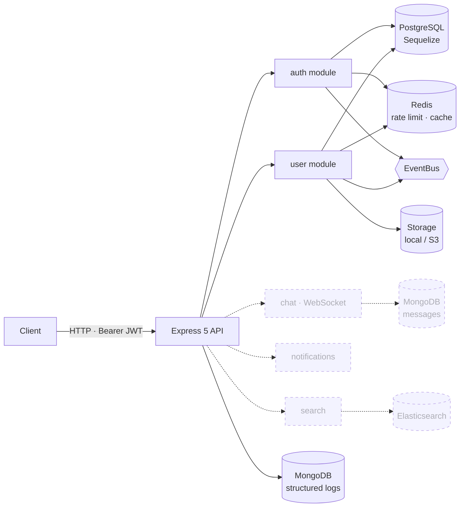

<div align="center">

# Real-Time Messaging Platform

**Backend for a real-time chat product, in Node.js and TypeScript** — Express 5 API with token auth and user profiles today; WebSocket messaging, presence, notifications and search on the way, each on the store that fits it.

[](#roadmap)
[](https://github.com/GabeSilvaDev/realtime-messaging-platform/actions/workflows/ci.yml)
[](https://nodejs.org)
[](https://www.typescriptlang.org)
[](https://expressjs.com)
[](https://www.postgresql.org)
[](https://redis.io)
[](https://www.mongodb.com)
[](https://www.elastic.co)
[](#development)
[](LICENSE)

**English** · [Português (Brasil)](README.pt-BR.md)

</div>

> **Work in progress.** Authentication, profiles and the shared infrastructure (databases, event bus, logger, validation, middleware, file storage) are implemented and tested. Messaging itself is the next milestone — see the [roadmap](#roadmap).

## Architecture



Solid nodes exist today; dashed ones are planned. Each feature is a **module** (`src/modules/<name>`) with its own controllers, services, repositories, models, DTOs, validation schemas, exceptions and routes, wired through interfaces. Everything cross-cutting lives in `src/shared`.

## What exists today

### Auth module — `/api/auth`

| Method | Endpoint | Auth | Notes |
|---|---|:---:|---|
| `POST` | `/register` | – | Creates the user, returns access + refresh tokens |
| `POST` | `/login` | – | |
| `POST` | `/refresh` | – | Rotates the refresh token |
| `POST` | `/logout` | ✓ | Revokes the current refresh token |
| `POST` | `/forgot-password` | – | Issues a reset token |
| `POST` | `/reset-password` | – | |
| `POST` | `/change-password` | ✓ | Rejects reusing the same password |
| `GET` | `/me` | ✓ | |
| `GET` | `/sessions` | ✓ | Active refresh tokens |
| `DELETE` | `/sessions` | ✓ | Revokes every session |

Access tokens expire in 15 min, refresh tokens in 7 days and are persisted per session (`refresh_tokens`). Passwords are hashed with bcrypt. Every failure is a typed exception (`InvalidCredentialsException`, `EmailAlreadyExistsException`, …) rendered by the global error handler.

### User module — `/api/profile`

| Method | Endpoint | Auth | Notes |
|---|---|:---:|---|
| `GET` / `PUT` / `PATCH` | `/` | ✓ | Read or update the own profile |
| `PUT` | `/display-name` · `/bio` · `/status` · `/settings` | ✓ | Field-level updates |
| `POST` / `DELETE` | `/avatar` | ✓ | Multipart upload, resized with sharp, stored locally or on S3 |
| `POST` | `/online` · `/offline` | ✓ | Presence flag |
| `GET` | `/stats` · `/settings` | ✓ | |
| `GET` | `/:userId` | – | Public profile |

A contacts service and repository (`contacts` table) are implemented and tested; their routes are not mounted yet.

### Shared infrastructure — `src/shared`

- **Databases** — connection helpers for PostgreSQL (Sequelize, with migrations and seeders), Redis (ioredis), MongoDB (Mongoose) and Elasticsearch, all started and stopped from `bootstrap.ts`.
- **EventBus** — in-process publish/subscribe with priorities, once-handlers, wildcard subscriptions and counters; modules emit domain events (e.g. auth events) through it.
- **Logger** — structured, leveled, categorised; console output in development and an optional MongoDB sink.
- **Middleware** — Helmet, CORS, request id, request logger, Redis-backed rate limiter, multer upload, 404 and error handlers.
- **Validation** — Zod schemas per module plus a `validate` middleware and shared pagination schemas.
- **Errors** — `AppError` hierarchy with HTTP status and error codes, serialised consistently.
- **Storage** — `StorageService` with local-disk and S3-compatible providers, `ImageProcessorService` on top of sharp.

## Getting started

Requires Docker and Docker Compose (or Node.js 22 with the four databases available).

```bash
git clone https://github.com/GabeSilvaDev/realtime-messaging-platform.git
cd realtime-messaging-platform
cp .env.example .env          # fill in the passwords — see Configuration

docker compose up -d          # app + PostgreSQL + Redis + MongoDB + Elasticsearch
docker exec rtm-app npx sequelize-cli db:migrate
docker exec rtm-app npx sequelize-cli db:seed:all   # optional demo users
```

The API listens on `http://localhost:3000/api`.

| Service | Container | Port |
|---|---|---|
| API (`tsx watch`) | `rtm-app` | 3000 |
| PostgreSQL 17 | `rtm-postgres` | 5432 |
| Redis 7 | `rtm-redis` | 6379 |
| MongoDB 8 | `rtm-mongodb` | 27017 |
| Elasticsearch 8.17 | `rtm-elasticsearch` | 9200 · 9300 |

Without Docker: `npm install`, set the variables from `.env.example`, then `npm run dev`.

## Development

```bash
npm run dev            # tsx watch src/server.ts
npm run build          # tsc → dist/
npm start              # node dist/server.js
npm run lint           # eslint src --fix
npm run format         # prettier
npm test               # jest --coverage --all
npx sequelize-cli db:migrate      # migrations (paths in .sequelizerc)
npx sequelize-cli db:seed:all     # seeders
```

**Tests** — 1,316 Jest tests in 73 suites (unit under `tests/unit`, HTTP feature tests with supertest under `tests/feature`). The config module reads the database variables at import time, so they must be non-empty even for unit tests: `POSTGRES_USER`, `POSTGRES_PASSWORD`, `POSTGRES_DB`, `REDIS_PASSWORD`, `MONGO_USER`, `MONGO_PASSWORD`, `MONGO_DB`, `ELASTIC_PASSWORD` (any value works; no database is contacted). CI sets them and runs ESLint, `tsc --noEmit` and the suite on every push.

## Project structure

```
src/
├── app.ts                    Express app: middleware pipeline and route mounting
├── bootstrap.ts              connects and disconnects the four stores
├── server.ts                 entry point
├── database/                 Sequelize migrations, seeders and factories
├── modules/
│   ├── auth/                 controllers · services (Auth, Token, Password) ·
│   │                         repositories (User, RefreshToken) · exceptions ·
│   │                         events · validation · routes
│   └── user/                 Profile controller · services (Profile, User,
│                             Contact, Avatar) · repositories · models · routes
└── shared/
    ├── config/               env → typed config (database, upload)
    ├── database/             postgres · redis · mongo · elasticsearch clients
    ├── event-bus/            EventBus + EventHandler
    ├── logger/               Logger + Mongo log model
    ├── middlewares/          helmet · cors · requestId · requestLogger ·
    │                         rateLimiter · upload · notFound · errorHandler
    ├── services/             FileService · ImageProcessorService · StorageService
    ├── validation/           validate middleware + common schemas
    ├── errors/ interfaces/ types/ constants/ utils/
tests/
├── unit/                     mirrors src/
└── feature/                  supertest against the Express app
```

## Configuration

`.env.example` lists every variable. The ones that matter:

| Variable | Purpose |
|---|---|
| `PORT`, `NODE_ENV` | HTTP port (3000) and environment |
| `POSTGRES_USER` / `POSTGRES_PASSWORD` / `POSTGRES_DB` | PostgreSQL (host `postgres` inside Compose) |
| `REDIS_PASSWORD` | Redis auth |
| `MONGO_USER` / `MONGO_PASSWORD` / `MONGO_DB` | MongoDB |
| `ELASTIC_PASSWORD` | Elasticsearch |
| `STORAGE_PROVIDER` | `local` or `s3` |
| `LOCAL_STORAGE_PATH`, `PUBLIC_URL` | Local provider |
| `AWS_ACCESS_KEY_ID` / `AWS_SECRET_ACCESS_KEY` / `AWS_S3_BUCKET` / `AWS_REGION` / `AWS_S3_ENDPOINT` | S3 provider (any S3-compatible endpoint) |

## Roadmap

- [x] Project skeleton — Express 5, TypeScript, ESLint + Prettier, Jest, Docker Compose with the four stores
- [x] Shared infrastructure — connections, EventBus, logger, middleware, validation, errors, storage
- [x] Auth — register, login, refresh-token rotation, sessions, password reset and change
- [x] User profiles — profile CRUD, avatar upload, status, settings, presence flag
- [~] Contacts — service and repository done, routes pending
- [ ] Chat — conversations and messages over Socket.IO, history in MongoDB
- [ ] Presence — online status and typing indicators through Redis pub/sub
- [ ] Notifications — in-app and push delivery
- [ ] Search — message search on Elasticsearch
- [ ] Observability — metrics and tracing

## License

[MIT](LICENSE) © [Gabriel Silva](https://github.com/GabeSilvaDev)
