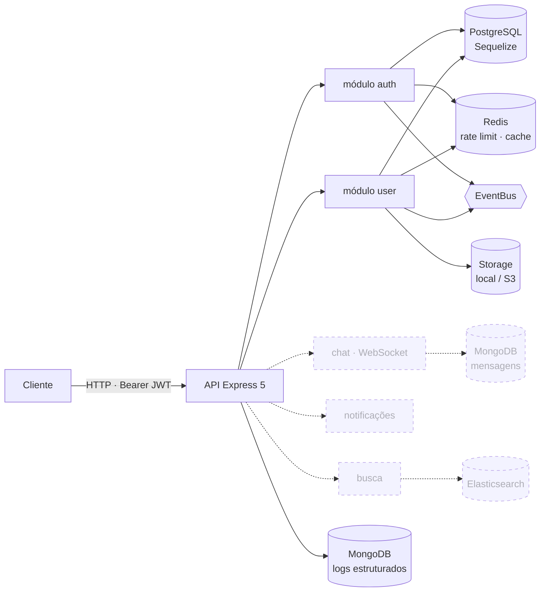

<div align="center">

# Real-Time Messaging Platform

**Backend de um produto de chat em tempo real, em Node.js e TypeScript** — API Express 5 com autenticação por token e perfis de usuário hoje; mensagens via WebSocket, presença, notificações e busca a caminho, cada um no banco que melhor o atende.

[](#roadmap)
[](https://github.com/GabeSilvaDev/realtime-messaging-platform/actions/workflows/ci.yml)
[](https://nodejs.org)
[](https://www.typescriptlang.org)
[](https://expressjs.com)
[](https://www.postgresql.org)
[](https://redis.io)
[](https://www.mongodb.com)
[](https://www.elastic.co)
[](#desenvolvimento)
[](LICENSE)

[English](README.md) · **Português (Brasil)**

</div>

> **Em desenvolvimento.** Autenticação, perfis e a infraestrutura compartilhada (bancos, event bus, logger, validação, middlewares, armazenamento de arquivos) estão implementados e testados. As mensagens em si são o próximo marco — veja o [roadmap](#roadmap).

## Arquitetura



Nós sólidos existem hoje; tracejados são planejados. Cada feature é um **módulo** (`src/modules/<nome>`) com seus próprios controllers, services, repositories, models, DTOs, schemas de validação, exceções e rotas, ligados por interfaces. Tudo que é transversal vive em `src/shared`.

## O que existe hoje

### Módulo auth — `/api/auth`

| Método | Endpoint | Auth | Observações |
|---|---|:---:|---|
| `POST` | `/register` | – | Cria o usuário, retorna access + refresh tokens |
| `POST` | `/login` | – | |
| `POST` | `/refresh` | – | Rotaciona o refresh token |
| `POST` | `/logout` | ✓ | Revoga o refresh token atual |
| `POST` | `/forgot-password` | – | Emite um token de reset |
| `POST` | `/reset-password` | – | |
| `POST` | `/change-password` | ✓ | Recusa repetir a mesma senha |
| `GET` | `/me` | ✓ | |
| `GET` | `/sessions` | ✓ | Refresh tokens ativos |
| `DELETE` | `/sessions` | ✓ | Revoga todas as sessões |

Access tokens expiram em 15 min, refresh tokens em 7 dias e são persistidos por sessão (`refresh_tokens`). Senhas com bcrypt. Toda falha é uma exceção tipada (`InvalidCredentialsException`, `EmailAlreadyExistsException`, …) renderizada pelo error handler global.

### Módulo user — `/api/profile`

| Método | Endpoint | Auth | Observações |
|---|---|:---:|---|
| `GET` / `PUT` / `PATCH` | `/` | ✓ | Lê ou atualiza o próprio perfil |
| `PUT` | `/display-name` · `/bio` · `/status` · `/settings` | ✓ | Atualizações por campo |
| `POST` / `DELETE` | `/avatar` | ✓ | Upload multipart, redimensionado com sharp, salvo local ou no S3 |
| `POST` | `/online` · `/offline` | ✓ | Flag de presença |
| `GET` | `/stats` · `/settings` | ✓ | |
| `GET` | `/:userId` | – | Perfil público |

Um service e um repository de contatos (tabela `contacts`) estão implementados e testados; as rotas ainda não foram montadas.

### Infraestrutura compartilhada — `src/shared`

- **Bancos** — helpers de conexão para PostgreSQL (Sequelize, com migrations e seeders), Redis (ioredis), MongoDB (Mongoose) e Elasticsearch, todos iniciados e encerrados pelo `bootstrap.ts`.
- **EventBus** — publish/subscribe em processo com prioridades, handlers de execução única, assinaturas wildcard e contadores; os módulos emitem eventos de domínio (ex.: eventos de auth) por ele.
- **Logger** — estruturado, com níveis e categorias; saída no console em desenvolvimento e sink opcional no MongoDB.
- **Middlewares** — Helmet, CORS, request id, request logger, rate limiter com Redis, upload via multer, handlers de 404 e de erro.
- **Validação** — schemas Zod por módulo, middleware `validate` e schemas comuns de paginação.
- **Erros** — hierarquia `AppError` com status HTTP e códigos de erro, serializada de forma consistente.
- **Storage** — `StorageService` com providers de disco local e S3-compatível, `ImageProcessorService` sobre o sharp.

## Como rodar

Requer Docker e Docker Compose (ou Node.js 22 com os quatro bancos disponíveis).

```bash
git clone https://github.com/GabeSilvaDev/realtime-messaging-platform.git
cd realtime-messaging-platform
cp .env.example .env          # preencha as senhas — veja Configuração

docker compose up -d          # app + PostgreSQL + Redis + MongoDB + Elasticsearch
docker exec rtm-app npx sequelize-cli db:migrate
docker exec rtm-app npx sequelize-cli db:seed:all   # usuários de demonstração, opcional
```

A API escuta em `http://localhost:3000/api`.

| Serviço | Container | Porta |
|---|---|---|
| API (`tsx watch`) | `rtm-app` | 3000 |
| PostgreSQL 17 | `rtm-postgres` | 5432 |
| Redis 7 | `rtm-redis` | 6379 |
| MongoDB 8 | `rtm-mongodb` | 27017 |
| Elasticsearch 8.17 | `rtm-elasticsearch` | 9200 · 9300 |

Sem Docker: `npm install`, defina as variáveis do `.env.example` e rode `npm run dev`.

## Desenvolvimento

```bash
npm run dev            # tsx watch src/server.ts
npm run build          # tsc → dist/
npm start              # node dist/server.js
npm run lint           # eslint src --fix
npm run format         # prettier --write (src + tests)
npm run format:check   # prettier --check, igual ao CI
npm test               # jest --coverage --all
npx sequelize-cli db:migrate      # migrations (caminhos no .sequelizerc)
npx sequelize-cli db:seed:all     # seeders
```

**Testes** — 1.316 testes Jest em 73 suítes (unitários em `tests/unit`, testes de feature HTTP com supertest em `tests/feature`). O módulo de config lê as variáveis de banco no import, então elas precisam estar preenchidas mesmo para testes unitários: `POSTGRES_USER`, `POSTGRES_PASSWORD`, `POSTGRES_DB`, `REDIS_PASSWORD`, `MONGO_USER`, `MONGO_PASSWORD`, `MONGO_DB`, `ELASTIC_PASSWORD` (qualquer valor serve; nenhum banco é acessado). O CI define todas e, a cada push e pull request, roda ESLint, uma checagem do Prettier, `tsc --noEmit` e a suíte. O build falha se a cobertura cair abaixo do nível atual (statements 76%, branches 62%, funções 72%, linhas 75% — veja `jest.config.ts`).

## Estrutura do projeto

```
src/
├── app.ts                    app Express: pipeline de middlewares e montagem de rotas
├── bootstrap.ts              conecta e desconecta os quatro bancos
├── server.ts                 ponto de entrada
├── database/                 migrations, seeders e factories do Sequelize
├── modules/
│   ├── auth/                 controllers · services (Auth, Token, Password) ·
│   │                         repositories (User, RefreshToken) · exceções ·
│   │                         eventos · validação · rotas
│   └── user/                 controller de Profile · services (Profile, User,
│                             Contact, Avatar) · repositories · models · rotas
└── shared/
    ├── config/               env → config tipada (database, upload)
    ├── database/             clientes postgres · redis · mongo · elasticsearch
    ├── event-bus/            EventBus + EventHandler
    ├── logger/               Logger + model de log no Mongo
    ├── middlewares/          helmet · cors · requestId · requestLogger ·
    │                         rateLimiter · upload · notFound · errorHandler
    ├── services/             FileService · ImageProcessorService · StorageService
    ├── validation/           middleware validate + schemas comuns
    ├── errors/ interfaces/ types/ constants/ utils/
tests/
├── unit/                     espelha src/
└── feature/                  supertest contra o app Express
```

## Configuração

O `.env.example` lista todas as variáveis. As que importam:

| Variável | Uso |
|---|---|
| `PORT`, `NODE_ENV` | Porta HTTP (3000) e ambiente |
| `POSTGRES_USER` / `POSTGRES_PASSWORD` / `POSTGRES_DB` | PostgreSQL (host `postgres` dentro do Compose) |
| `REDIS_PASSWORD` | Auth do Redis |
| `MONGO_USER` / `MONGO_PASSWORD` / `MONGO_DB` | MongoDB |
| `ELASTIC_PASSWORD` | Elasticsearch |
| `STORAGE_PROVIDER` | `local` ou `s3` |
| `LOCAL_STORAGE_PATH`, `PUBLIC_URL` | Provider local |
| `AWS_ACCESS_KEY_ID` / `AWS_SECRET_ACCESS_KEY` / `AWS_S3_BUCKET` / `AWS_REGION` / `AWS_S3_ENDPOINT` | Provider S3 (qualquer endpoint compatível) |

## Roadmap

- [x] Esqueleto — Express 5, TypeScript, ESLint + Prettier, Jest, Docker Compose com os quatro bancos
- [x] Infraestrutura compartilhada — conexões, EventBus, logger, middlewares, validação, erros, storage
- [x] Auth — registro, login, rotação de refresh token, sessões, reset e troca de senha
- [x] Perfis — CRUD de perfil, upload de avatar, status, configurações, flag de presença
- [~] Contatos — service e repository prontos, rotas pendentes
- [ ] Chat — conversas e mensagens via Socket.IO, histórico no MongoDB
- [ ] Presença — status online e indicador de digitação via Redis pub/sub
- [ ] Notificações — entrega in-app e push
- [ ] Busca — busca de mensagens no Elasticsearch
- [ ] Observabilidade — métricas e tracing

## Licença

[MIT](LICENSE) © [Gabriel Silva](https://github.com/GabeSilvaDev)
